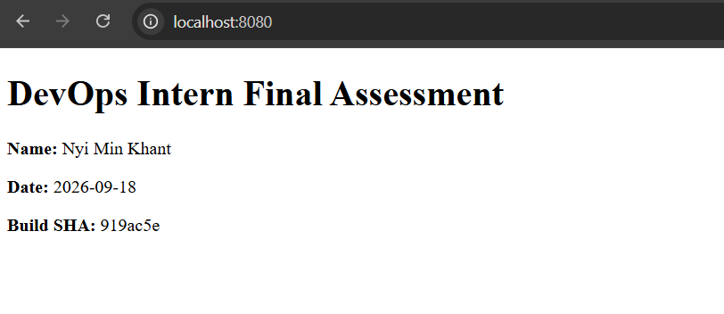
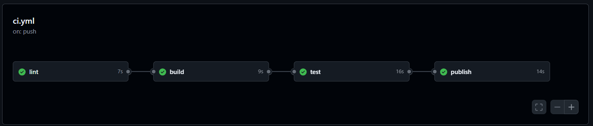
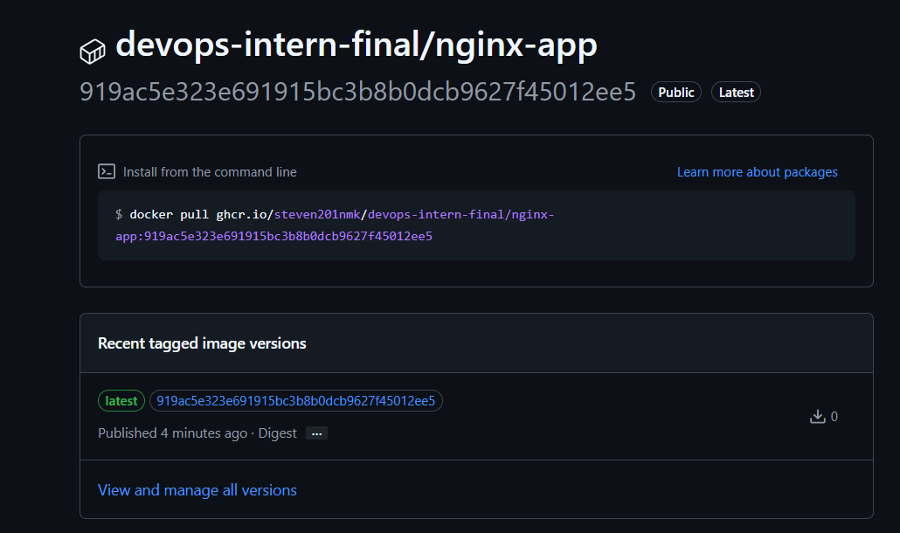
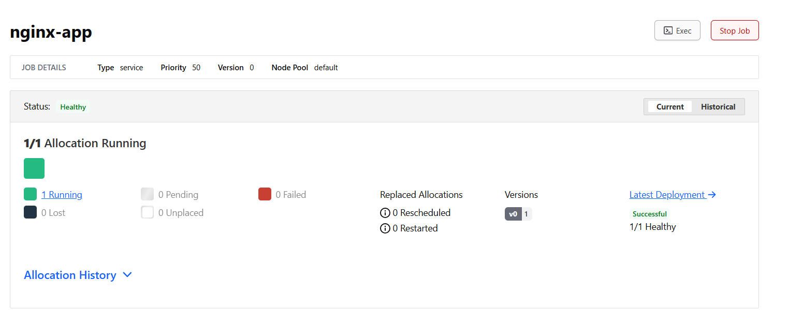
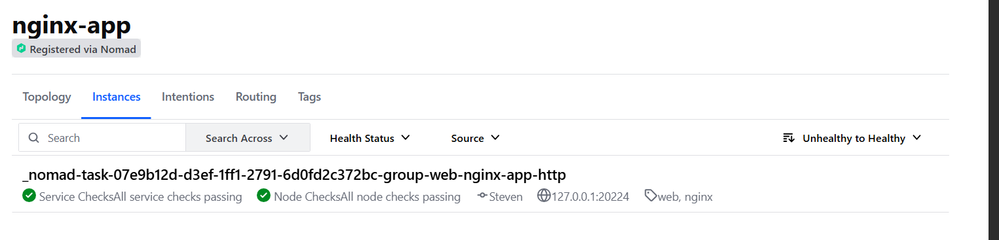

# DevOps Intern Final Assessment

[](https://github.com/steven201nmk/devops-intern-final/actions/workflows/ci.yml)

| | |
|---|---|
| **Name** | Nyi Min Khant |
| **GitHub** | [@steven201nmk](https://github.com/steven201nmk) |
| **Submission date** | 2026-10-07 |
| **Release tag** | [`v1.0.0`](https://github.com/steven201nmk/devops-intern-final/tree/v1.0.0) |
| **Container image** | [`ghcr.io/steven201nmk/devops-intern-final/nginx-app`](https://github.com/steven201nmk/devops-intern-final/pkgs/container/devops-intern-final%2Fnginx-app) |

An end-to-end deployment pipeline for a containerised NGINX web application:
source control → automated CI → container registry → Nomad deployment → log aggregation in Grafana Loki.
Based on [chakilams/simple-nginx-app](https://github.com/chakilams/simple-nginx-app), with the Kubernetes manifests replaced by a Nomad job.

## Contents

1. [Architecture](#architecture)
2. [Prerequisites](#prerequisites)
3. [Quick Start](#quick-start)
4. [Repository Layout](#repository-layout)
5. [Task 1 — Source Control](#task-1--source-control)
6. [Task 2 — Linux Scripting](#task-2--linux-scripting)
7. [Task 3 — Containerisation](#task-3--containerisation)
8. [Task 4 — Continuous Integration](#task-4--continuous-integration)
9. [Task 5 — Orchestration with Nomad](#task-5--orchestration-with-nomad)
10. [Task 6 — Log Aggregation with Grafana Loki](#task-6--log-aggregation-with-grafana-loki)
11. [Troubleshooting](#troubleshooting)
12. [Known Limitations](#known-limitations)

---

## Architecture

Every stage consumes the output of the one before it. A commit to `main` is linted, built and tested by GitHub Actions. The tested image is pushed to GHCR, tagged with the commit SHA. Nomad deploys that exact SHA tag and registers the service with Consul, which health-checks `/healthz`. Promtail ships the container's NGINX access logs to Loki, where they are queried in Grafana.

```text
  ┌─────────────────────┐
  │  Source (GitHub)    │  feature/* branch -> pull request -> main
  └──────────┬──────────┘
             │ push / pull_request
             ▼
  ┌─────────────────────┐
  │  CI (GitHub Actions)│  lint -> build -> test -> publish
  └──────────┬──────────┘
             │ docker push  :<git-sha>  :latest
             ▼
  ┌─────────────────────┐
  │  Registry (GHCR)    │  ghcr.io/steven201nmk/devops-intern-final/nginx-app
  └──────────┬──────────┘
             │ docker pull  :<git-sha>   (Nomad variable app_tag)
             ▼
  ┌─────────────────────┐        ┌──────────────────────┐
  │  Nomad (docker)     │───────>│  Consul              │
  │  job nginx-app      │register│  check GET /healthz  │
  └──────────┬──────────┘        └──────────────────────┘
             │ container stdout (NGINX access logs)
             ▼
  ┌─────────────────────┐        ┌──────────────────────┐
  │  Promtail -> Loki   │<───────│  Grafana (Explore)   │
  │  labels: job,       │ LogQL  │  localhost:3000      │
  │  container, alloc_id│        └──────────────────────┘
  └─────────────────────┘
```

| Stage | Input | Output | Defined in |
|---|---|---|---|
| Source | Code changes on a `feature/*` branch | Merged commit on `main` | Git / GitHub |
| CI | Commit on `main` | Tested image | `.github/workflows/ci.yml` |
| Registry | Tested image | `nginx-app:<git-sha>` and `:latest` in GHCR | `publish` job |
| Orchestration | `nginx-app:<git-sha>` | Healthy allocation registered in Consul | `nomad/nginx-app.nomad.hcl` |
| Observability | Container stdout | Labelled log streams in Loki | `monitoring/` |

---

## Prerequisites

Tested on: Windows 11 with WSL 2, running **Ubuntu 24.04.5 LTS** (kernel `6.6.87.2-microsoft-standard-WSL2`) and Docker Desktop with WSL integration.

| Tool | Version used | Check with |
|---|---|---|
| Docker Engine | 29.8.0 | `docker version` |
| Docker Compose | v5.5.1 | `docker compose version` |
| HashiCorp Nomad | v2.0.7 | `nomad version` |
| HashiCorp Consul | v2.0.4 | `consul version` |
| ShellCheck | 0.9.0 | `shellcheck --version` |
| hadolint | 2.12.0 | `hadolint --version` |
| git | 2.43.0 | `git --version` |

**Installing the tools on Ubuntu 24.04** (Docker comes from Docker Desktop or Docker Engine):

```bash
sudo apt-get update
sudo apt-get install -y gpg lsb-release wget curl shellcheck
wget -O- https://apt.releases.hashicorp.com/gpg | sudo gpg --dearmor -o /usr/share/keyrings/hashicorp-archive-keyring.gpg
echo "deb [signed-by=/usr/share/keyrings/hashicorp-archive-keyring.gpg] https://apt.releases.hashicorp.com $(lsb_release -cs) main" | sudo tee /etc/apt/sources.list.d/hashicorp.list
sudo apt-get update && sudo apt-get install -y nomad consul
sudo wget -O /usr/local/bin/hadolint https://github.com/hadolint/hadolint/releases/download/v2.12.0/hadolint-Linux-x86_64
sudo chmod +x /usr/local/bin/hadolint
```

---

## Quick Start

From a clean clone to the running application in five commands:

```bash
git clone https://github.com/steven201nmk/devops-intern-final.git
cd devops-intern-final
docker build --build-arg BUILD_SHA="$(git rev-parse --short HEAD)" -t nginx-app:local ./app
docker run -d --name nginx-app -p 8080:8080 nginx-app:local
./scripts/healthcheck.sh http://localhost:8080/healthz
```

Open <http://localhost:8080> to see the page with my name, the assessment date and the build SHA.
Clean up with `docker rm -f nginx-app`.

To deploy with Nomad instead, see [Task 5](#task-5--orchestration-with-nomad). For the logging stack, see [Task 6](#task-6--log-aggregation-with-grafana-loki).

---

## Repository Layout

```text
devops-intern-final/
├── README.md
├── .gitignore
├── .gitattributes          # keeps every text file LF (Windows-safe)
├── app/
│   ├── Dockerfile              # pinned nginx:1.27-alpine, non-root, HEALTHCHECK
│   ├── index.html              # name, date, BUILD_SHA placeholder
│   └── nginx.conf              # listens on 8080, /healthz returns 200
├── scripts/
│   ├── sysinfo.sh              # host environment report
│   └── healthcheck.sh          # asserts HTTP 200 on a URL
├── .github/
│   └── workflows/
│       └── ci.yml              # lint -> build -> test -> publish
├── nomad/
│   └── nginx-app.nomad.hcl     # service job, Consul check, rolling update
├── monitoring/
│   ├── loki-config.yaml
│   ├── promtail-config.yaml
│   ├── docker-compose.yaml     # Loki + Promtail + Grafana
│   └── loki_setup.md           # detailed Loki notes
└── docs/
    └── screenshots/
```

---

## Task 1 — Source Control

**Workflow used**

- All changes are made on `feature/*` branches and merged to `main` through a pull request with a short description.
  - Merged PR: [#1 fix: bring the pipeline in line with the assessment brief](https://github.com/steven201nmk/devops-intern-final/pull/1), merged with a merge commit so the individual commits stay in the history
- Commit messages follow [Conventional Commits](https://www.conventionalcommits.org/): `feat:`, `fix:`, `docs:`, `ci:`.
- IDE metadata (`.idea/`, `.vscode/`), build artefacts and local secrets (`.env`, `*.pem`) are excluded by `.gitignore`.
- The final state is tagged `v1.0.0`.

**Commands**

```bash
git switch -c feature/<short-name>
git add <files>
git commit -m "feat: <what changed>"
git push -u origin feature/<short-name>
# open a pull request to main on GitHub, self-review it, then merge

git switch main && git pull
git tag -a v1.0.0 -m "v1.0.0: final submission"
git push origin v1.0.0
```

**Observed output:** `git log --oneline --graph --decorate -20 main feature/docs-evidence` (taken while the second PR was being prepared)

```text
* 84cc347 (feature/docs-evidence) fix(monitoring): keep only access-log lines in the pattern-based LogQL queries
* b0007c8 fix(nomad): compare app_tag as a string in its validation rule
* 0034490 docs: add observed output for prerequisites, Tasks 2-4 and screenshots
*   919ac5e (origin/main, main) Merge pull request #1 from steven201nmk/feature/fix-pipeline
|\
| * 84ca006 (origin/feature/fix-pipeline) docs: add README with architecture, quick start and per-task evidence sections
| * da709b8 feat(monitoring): label logs by job/service/stream and fix the LogQL queries
| * 3373a31 fix(nomad): deploy the CI image by commit SHA and label containers for Promtail
| * d29f8da ci: add hadolint, pass BUILD_SHA, gate on healthcheck.sh, tag images by SHA
| * 6f54045 fix(app): drop debug build step and return plain-text /healthz
| * d9c6a2c fix(scripts): use bash strict mode, assert HTTP 200 exactly, mark executable
| * 1ede25d fix: remove UTF-8 BOM from Dockerfile, HTML and config files
| * 25ea9d9 chore: enforce LF line endings and ignore local tool binaries
|/
* 6bb9f65 index.html
* 80cc8e8 nginx-app.nomad.hcl
* 4cb6ba4 Update ci.yml
* 3676d99 Update ci.yml
* 998c660 Update Dockerfile
* 67fc5d9 Fix nginx non-root configuration
```

The early commits (`Update ci.yml`, `index.html`, ...) were made in the GitHub web editor before I adopted Conventional Commits. Everything from `25ea9d9` onwards follows the convention and went through a pull request.

---

## Task 2 — Linux Scripting

Both scripts start with `#!/usr/bin/env bash` and `set -euo pipefail`. They use bash rather than `/bin/sh` because `pipefail` isn't available in `dash`, which is `/bin/sh` on Ubuntu. Otherwise they only use POSIX utilities. Both are committed as executable (`git update-index --chmod=+x`, mode `100755`) and pass ShellCheck with no findings.

| Script | Purpose | Exit codes |
|---|---|---|
| `scripts/sysinfo.sh` | Prints the current user and effective UID, hostname, kernel release, ISO-8601 date (UTC), disk usage, memory usage and Docker daemon status | `0` |
| `scripts/healthcheck.sh [URL]` | Requests `URL` (default `http://localhost:8080`) and checks that the status is exactly `200`. It prints the status code it received | `0` = 200, `1` = other status, `2` = unreachable, `3` = curl missing |

**Lint and permissions**

```bash
shellcheck scripts/*.sh && echo "ShellCheck: no issues"
git ls-files -s scripts/          # mode 100755 means executable in Git
```

```text
$ shellcheck scripts/*.sh && echo 'ShellCheck: no issues'
ShellCheck: no issues

$ git ls-files -s scripts/
100755 36263a25a0c575c18787de634d42efff95c5d0c8 0       scripts/healthcheck.sh
100755 201b76ed8cc584c61fec2bbd3957c7118afb326f 0       scripts/sysinfo.sh
```

**`sysinfo.sh`**

```bash
./scripts/sysinfo.sh
```

```text
$ ./scripts/sysinfo.sh

== User ==
User:            steven
Effective UID:   1000

== Host ==
Hostname:        Steven
Kernel release:  6.6.87.2-microsoft-standard-WSL2

== Date (ISO-8601, UTC) ==
2026-10-07T05:29:24Z

== Disk usage (/) ==
Filesystem      Size  Used Avail Use% Mounted on
/dev/sdf       1007G  2.4G  954G   1% /

== Memory usage ==
               total        used        free      shared  buff/cache   available
Mem:            15Gi       1.1Gi        12Gi        49Mi       2.4Gi        14Gi
Swap:          4.0Gi          0B       4.0Gi

== Docker daemon ==
Status: running (server version 29.8.0)
```

**`healthcheck.sh`, success and failure cases**

```bash
./scripts/healthcheck.sh;                                   echo "exit=$?"   # default URL
./scripts/healthcheck.sh http://localhost:8080/healthz;     echo "exit=$?"
./scripts/healthcheck.sh http://localhost:8080/missing;     echo "exit=$?"   # 404
./scripts/healthcheck.sh http://localhost:9999;             echo "exit=$?"   # nothing listening
```

```text
$ ./scripts/healthcheck.sh; echo "exit=$?"
Checking http://localhost:8080 ...
OK: http://localhost:8080 returned HTTP 200
exit=0

$ ./scripts/healthcheck.sh http://localhost:8080/healthz; echo "exit=$?"
Checking http://localhost:8080/healthz ...
OK: http://localhost:8080/healthz returned HTTP 200
exit=0

$ ./scripts/healthcheck.sh http://localhost:8080/missing; echo "exit=$?"
Checking http://localhost:8080/missing ...
FAIL: http://localhost:8080/missing returned HTTP 404, expected 200
exit=1

$ ./scripts/healthcheck.sh http://localhost:9999; echo "exit=$?"
Checking http://localhost:9999 ...
FAIL: http://localhost:9999 is unreachable (no HTTP response within 5s)
exit=2
```

The four cases return the four documented outcomes: `0` for a 200, `1` for a 404, and `2` when nothing is listening.

---

## Task 3 — Containerisation

| Requirement | How it is met |
|---|---|
| Pinned base image | `FROM nginx:1.27-alpine` (never `latest`) |
| Port 8080 and `/healthz` | `app/nginx.conf`: `listen 8080;` and `location = /healthz` returns `200 OK` as `text/plain`, with `access_log off` so health probes don't flood the logs |
| Non-root runtime | `USER nginx` (UID 101). The PID file and temp paths are moved to `/tmp` so NGINX can start without root |
| `EXPOSE` and `HEALTHCHECK` | `EXPOSE 8080`, and the `HEALTHCHECK` curls `/healthz` every 10 s |
| Build identifier | `ARG BUILD_SHA` is written into `index.html` at build time and recorded as the `org.opencontainers.image.revision` label |
| Image under 60 MB | **52.7 MB** unpacked (sum of all layers) and **21 MB** compressed in the registry. See the note below |

**Build and run**

```bash
docker build --build-arg BUILD_SHA="$(git rev-parse --short HEAD)" -t nginx-app:local ./app
docker images nginx-app:local
docker history nginx-app:local --format '{{.Size}}' | awk '/kB$/{s+=$1/1000} /MB$/{s+=$1} /GB$/{s+=$1*1000} END{printf "Sum of uncompressed layers: %.1f MB\n", s}'
docker run -d --name nginx-app -p 8080:8080 nginx-app:local
```

```text
$ docker build --build-arg BUILD_SHA="$(git rev-parse --short HEAD)" -t nginx-app:local ./app 2>&1 | tail -n 4
#10 exporting manifest list sha256:9e06876a8da26a24db48c1702b77666ab7a61140bcd4d09d25637518d3ef27b3 0.0s done
#10 naming to docker.io/library/nginx-app:local done
#10 unpacking to docker.io/library/nginx-app:local done
#10 DONE 0.1s

$ docker images nginx-app:local
IMAGE             ID             DISK USAGE   CONTENT SIZE   EXTRA
nginx-app:local   9e06876a8da2       73.7MB           21MB

$ docker history nginx-app:local --format '{{.Size}}' | awk '/kB$/{s+=$1/1000} /MB$/{s+=$1} /GB$/{s+=$1*1000} END{printf "Sum of uncompressed layers: %.1f MB\n", s}'
Sum of uncompressed layers: 52.7 MB

$ docker run -d --name nginx-app -p 8080:8080 nginx-app:local
a080a3f83ad220607edf4adb68bea0a3859ec5b7655e94817146ad6bf085d814
```

**About the image size.** Docker 29 uses the containerd image store by default. Its `DISK USAGE` column adds the unpacked layers (52.7 MB) and the compressed download (21 MB, the `CONTENT SIZE`) together, which gives 73.7 MB. The image itself is the sum of its layers: **52.7 MB**, which is under the 60 MB limit. About 52.6 MB of that is the `nginx:1.27-alpine` base, and my own layers add about 110 kB. On the classic storage driver, `docker images` reports the same image as roughly 52.7 MB.

**Serving traffic**

```bash
curl -si http://localhost:8080/
curl -si http://localhost:8080/healthz
```

```text
$ curl -si http://localhost:8080/
HTTP/1.1 200 OK
Server: nginx/1.27.5
Date: Wed, 07 Oct 2026 05:29:24 GMT
Content-Type: text/html
Content-Length: 332
Last-Modified: Wed, 07 Oct 2026 05:05:28 GMT
Connection: keep-alive
ETag: "6ac5d318-14c"
Accept-Ranges: bytes

<!DOCTYPE html>
<html lang="en">
<head>
    <meta charset="UTF-8">
    <title>DevOps Intern Final Assessment</title>
</head>
<body>
    <h1>DevOps Intern Final Assessment</h1>
    <p><strong>Name:</strong> Nyi Min Khant</p>
    <p><strong>Date:</strong> 2026-09-18</p>
    <p><strong>Build SHA:</strong> 919ac5e</p>
</body>
</html>

$ curl -si http://localhost:8080/healthz
HTTP/1.1 200 OK
Server: nginx/1.27.5
Date: Wed, 07 Oct 2026 05:29:24 GMT
Content-Type: text/plain
Content-Length: 3
Connection: keep-alive

OK
```

The page shows the build SHA (`919ac5e`, the commit the image was built from), and `/healthz` returns a plain-text `OK` with a single `Content-Type` header.

**Non-root and health status**

```bash
hadolint app/Dockerfile && echo "hadolint: no issues"
docker exec nginx-app id
docker inspect --format '{{.State.Health.Status}}' nginx-app
```

```text
$ hadolint app/Dockerfile && echo 'hadolint: no issues'
hadolint: no issues

$ docker exec nginx-app id
uid=101(nginx) gid=101(nginx) groups=101(nginx)

$ docker inspect --format '{{.State.Health.Status}}' nginx-app
healthy
```



---

## Task 4 — Continuous Integration

`.github/workflows/ci.yml` runs on every push and pull request to `main`.

| Job | What it does | Runs on |
|---|---|---|
| `lint` | `shellcheck scripts/*.sh`, then hadolint (pinned `hadolint/hadolint:v2.12.0` image) on `app/Dockerfile` | push and PR |
| `build` | `docker build --build-arg BUILD_SHA=${{ github.sha }}`, then saves the image as a workflow artifact | push and PR |
| `test` | Loads that exact image, starts it, waits until the Docker `HEALTHCHECK` reports `healthy`, then runs `scripts/healthcheck.sh` against `/` and `/healthz` and checks that the page contains the commit SHA. Any non-200 fails the job, so `publish` never runs | push and PR |
| `publish` | Pushes the tested image (not a rebuild) to GHCR as `:${{ github.sha }}` and `:latest` | push to `main` only |

**Security**

- Registry login uses the short-lived `GITHUB_TOKEN`, passed through `--password-stdin`. No personal tokens or other long-lived credentials are stored in the repository.
- The workflow's default `permissions` are `contents: read`. Only the `publish` job is granted `packages: write`.
- Only GitHub's own actions are used, each pinned to a major version: `actions/checkout@v5`, `actions/upload-artifact@v7` and `actions/download-artifact@v8`. Hadolint runs from a pinned image tag. No third-party marketplace actions are used.

**Evidence**

- Green run on `main` for the PR #1 merge commit, with all four jobs passing: [actions/runs/37572533810](https://github.com/steven201nmk/devops-intern-final/actions/runs/37572533810)
- The same pipeline on the pull request, where `publish` is correctly skipped: [actions/runs/37571368003](https://github.com/steven201nmk/devops-intern-final/actions/runs/37571368003)
- Published image tags: `919ac5e323e691915bc3b8b0dcb9627f45012ee5` (the merge commit) and `latest`

```bash
export SHA="$(git rev-parse origin/main)"
docker pull ghcr.io/steven201nmk/devops-intern-final/nginx-app:$SHA
```

```text
$ export SHA="$(git rev-parse origin/main)"; echo "$SHA"
919ac5e323e691915bc3b8b0dcb9627f45012ee5

$ docker pull ghcr.io/steven201nmk/devops-intern-final/nginx-app:$SHA
919ac5e323e691915bc3b8b0dcb9627f45012ee5: Pulling from steven201nmk/devops-intern-final/nginx-app
Digest: sha256:52b9b3f27301dcaae6b0270a11cdc0197dfbe889268d6722ca5208a41f80dbae
Status: Image is up to date for ghcr.io/steven201nmk/devops-intern-final/nginx-app:919ac5e323e691915bc3b8b0dcb9627f45012ee5
ghcr.io/steven201nmk/devops-intern-final/nginx-app:919ac5e323e691915bc3b8b0dcb9627f45012ee5
```





---

## Task 5 — Orchestration with Nomad

`nomad/nginx-app.nomad.hcl` deploys the image that CI published. It pulls the image by commit SHA, and the tag is set with the `app_tag` variable. The variable has no default, and a `validation` rule rejects `latest`, so every deployment is pinned to a commit.

| Requirement | Setting |
|---|---|
| Job type | `type = "service"`, one group (`web`), one task (`nginx`), `docker` driver |
| Image | `ghcr.io/steven201nmk/devops-intern-final/nginx-app:${var.app_tag}` |
| Resources | `cpu = 100` (MHz), `memory = 64` (MB). These are the values in the brief, with no deviation |
| Networking | Dynamic port named `http`, mapped to container port `8080` |
| Service discovery | Consul service `nginx-app` with an HTTP check on `/healthz`, `interval = "10s"`, `timeout = "2s"`. `check_restart` restarts the task after 3 failed checks |
| Rolling update | `max_parallel = 1`, `min_healthy_time = "10s"`, `healthy_deadline = "2m"`, `auto_revert = true` |
| Failure handling | `restart`: 2 in-place restarts per minute, then fail. `reschedule`: up to 3 new placements in 5 minutes, with exponential back-off |
| Log labels | Docker labels `job` and `service` (`nginx-app`) for Promtail. Nomad adds `com.hashicorp.nomad.alloc_id` itself |

**Start local agents**, each in its own terminal:

```bash
consul agent -dev
sudo nomad agent -dev        # root is needed for the docker driver on Linux
```

Then, in a third terminal, check that both agents are up:

```bash
consul members
nomad node status
```

```text
$ consul members
Node    Address         Status  Type    Build  Protocol  DC   Partition  Segment
Steven  127.0.0.1:8301  alive   server  2.0.4  2         dc1  default    <all>

$ nomad node status
ID        Node Pool  DC   Name    Class   Drain  Eligibility  Status
260a949e  default    dc1  Steven  <none>  false  eligible     ready
```

**Validate, plan, run and check status**

```bash
export SHA="$(git rev-parse origin/main)"   # full 40-character SHA of a commit CI has published

nomad job validate -var "app_tag=$SHA"   nomad/nginx-app.nomad.hcl
nomad job validate -var "app_tag=latest" nomad/nginx-app.nomad.hcl   # must be rejected
nomad job plan     -var "app_tag=$SHA"   nomad/nginx-app.nomad.hcl
nomad job run      -var "app_tag=$SHA"   nomad/nginx-app.nomad.hcl
nomad job status nginx-app
```

```text
$ nomad job validate -var "app_tag=$SHA" nomad/nginx-app.nomad.hcl
Job Warnings:
1 warning:

* group "web" defines services, but neither the group nor any of its tasks have shutdown_delay set

Job validation successful

$ nomad job validate -var "app_tag=latest" nomad/nginx-app.nomad.hcl   # expected to be rejected
Error getting job struct: Error parsing job file from nomad/nginx-app.nomad.hcl:
:0,0-0: Invalid value for cmd variable; Deploy an immutable commit-SHA tag, not "latest".

This was checked by the validation rule at nginx-app.nomad.hcl:11,3-13.

$ nomad job plan -var "app_tag=$SHA" nomad/nginx-app.nomad.hcl
+ Job: "nginx-app"
+ Task Group: "web" (1 create)
  + Task: "nginx" (forces create)

Scheduler dry-run:
- All tasks successfully allocated.

Job Warnings:
1 warning:

* group "web" defines services, but neither the group nor any of its tasks have shutdown_delay set
(... check-index hint trimmed ...)

$ nomad job run -var "app_tag=$SHA" nomad/nginx-app.nomad.hcl
Job Warnings:
1 warning:

* group "web" defines services, but neither the group nor any of its tasks have shutdown_delay set
==> View this job in the Web UI: http://127.0.0.1:4646/ui/jobs/nginx-app@default

==> 2026-10-07T13:44:41+08:00: Monitoring evaluation "302552a1"
    2026-10-07T13:44:41+08:00: Evaluation triggered by job "nginx-app"
    2026-10-07T13:44:41+08:00: Evaluation within deployment: "4bdac061"
    2026-10-07T13:44:41+08:00: Allocation "07e9b12d" created: node "260a949e", group "web"
    2026-10-07T13:44:41+08:00: Evaluation status changed: "pending" -> "complete"
==> 2026-10-07T13:44:41+08:00: Evaluation "302552a1" finished with status "complete"
==> 2026-10-07T13:44:41+08:00: Monitoring deployment "4bdac061"
    
2026-10-07T13:44:41+08:00
ID          = 4bdac061
Job ID      = nginx-app
Job Version = 0
Status      = running
Description = Deployment is running

Deployed
Task Group  Auto Revert  Desired  Placed  Healthy  Unhealthy  Progress Deadline
web         true         1        1       0        0          2026-10-07T13:54:41+08:00
    
2026-10-07T13:44:55+08:00
ID          = 4bdac061
Job ID      = nginx-app
Job Version = 0
Status      = running
Description = Deployment is running

Deployed
Task Group  Auto Revert  Desired  Placed  Healthy  Unhealthy  Progress Deadline
web         true         1        1       1        0          2026-10-07T13:54:55+08:00
    
2026-10-07T13:44:56+08:00
ID          = 4bdac061
Job ID      = nginx-app
Job Version = 0
Status      = successful
Description = Deployment completed successfully

Deployed
Task Group  Auto Revert  Desired  Placed  Healthy  Unhealthy  Progress Deadline
web         true         1        1       1        0          2026-10-07T13:54:55+08:00

$ nomad job status nginx-app
ID            = nginx-app
Name          = nginx-app
Submit Date   = 2026-10-07T13:44:41+08:00
Type          = service
Priority      = 50
Datacenters   = dc1
Namespace     = default
Node Pool     = default
Status        = running
Periodic      = false
Parameterized = false

Summary
Task Group  Queued  Starting  Running  Failed  Complete  Lost  Unknown
web         0       0         1        0       0         0     0

Latest Deployment
ID          = 4bdac061
Status      = successful
Description = Deployment completed successfully

Deployed
Task Group  Auto Revert  Desired  Placed  Healthy  Unhealthy  Progress Deadline
web         true         1        1       1        0          2026-10-07T13:54:55+08:00

Allocations
ID        Node ID   Task Group  Version  Desired  Status   Created  Modified
07e9b12d  260a949e  web         0        run      running  15s ago  2s ago
```

`nomad job run` watched the rolling deployment until it reported `successful`: 1 placed, 1 healthy, auto-revert enabled. The `latest` tag is rejected by the variable's validation rule before Nomad schedules anything.

About the warning: Nomad 2.0 suggests a `shutdown_delay` for groups with services, so that Consul deregisters an instance before it stops during a rolling update. With a single instance there is nowhere else to send traffic, so I left it out. See Known Limitations.

**Allocation health and Consul check**

```bash
nomad alloc status <alloc-id>                                       # shows the dynamic port for "http"
docker ps --filter label=job=nginx-app
curl -s http://127.0.0.1:8500/v1/catalog/service/nginx-app          # Consul service registration
curl -si http://127.0.0.1:<dynamic-port>/healthz
curl -s http://127.0.0.1:8500/v1/health/checks/nginx-app            # Consul health check
```

```text
$ nomad alloc status $ALLOC
ID                  = 07e9b12d-d3ef-1ff1-2791-6d0fd2c372bc
Eval ID             = 302552a1
Name                = nginx-app.web[0]
Node ID             = 260a949e
Node Name           = Steven
Job ID              = nginx-app
Job Version         = 0
Client Status       = running
Client Description  = Tasks are running
Desired Status      = run
Desired Description = <none>
Created             = 15s ago
Modified            = 2s ago
Deployment ID       = 4bdac061
Deployment Health   = healthy

Allocation Addresses:
Label  Dynamic  Address
*http  yes      127.0.0.1:20224 -> 8080

Task "nginx" is "running"
Task Resources:
CPU        Memory         Disk     Addresses
0/100 MHz  12 MiB/64 MiB  300 MiB  

Task Events:
Started At     = 2026-10-07T05:44:42Z
Finished At    = N/A
Total Restarts = 0
Last Restart   = N/A

Recent Events:
Time                       Type        Description
2026-10-07T13:44:42+08:00  Started     Task started by client
2026-10-07T13:44:41+08:00  Task Setup  Building Task Directory
2026-10-07T13:44:41+08:00  Received    Task received by client

$ docker ps --filter label=job=nginx-app --format 'table {{.Names}}\t{{.Image}}\t{{.Ports}}\t{{.Status}}'
NAMES                                        IMAGE                                                                                         PORTS                                                  STATUS
nginx-07e9b12d-d3ef-1ff1-2791-6d0fd2c372bc   ghcr.io/steven201nmk/devops-intern-final/nginx-app:919ac5e323e691915bc3b8b0dcb9627f45012ee5   127.0.0.1:20224->8080/tcp, 127.0.0.1:20224->8080/udp   Up 15 seconds (healthy)

$ curl -s http://127.0.0.1:8500/v1/catalog/service/nginx-app | python3 -c 'import json,sys; s=json.load(sys.stdin)[0]; print("service:", s["ServiceName"], "| address:", s["ServiceAddress"]+":"+str(s["ServicePort"]), "| tags:", s["ServiceTags"])'
service: nginx-app | address: 127.0.0.1:20224 | tags: ['web', 'nginx']

$ curl -si http://127.0.0.1:20224/healthz
HTTP/1.1 200 OK
Server: nginx/1.27.5
Date: Wed, 07 Oct 2026 05:44:57 GMT
Content-Type: text/plain
Content-Length: 3
Connection: keep-alive

OK

$ curl -s http://127.0.0.1:8500/v1/health/checks/nginx-app | python3 -c 'import json,sys; [print(c["Name"], "->", c["Status"], "|", c["Output"].strip()) for c in json.load(sys.stdin)]'
nginx-healthz -> passing | HTTP GET http://127.0.0.1:20224/healthz: 200 OK Output: OK
```

The allocation uses 12 MiB of its 64 MiB memory limit. Nomad gave it the dynamic host port `20224`, mapped to the container's `8080`, and Consul's `nginx-healthz` check against `/healthz` is `passing`.





---

## Task 6 — Log Aggregation with Grafana Loki

Full notes, including the problems I hit, are in [`monitoring/loki_setup.md`](monitoring/loki_setup.md).

**Start the stack**

```bash
cd monitoring
docker compose up -d
docker compose ps
curl -s http://localhost:3100/ready
```

```text
$ cd monitoring && docker compose up -d
 Network monitoring_monitoring Created
 Container monitoring-loki-1 Created
 Container monitoring-promtail-1 Created
 Container monitoring-grafana-1 Created
 Container monitoring-loki-1 Started
 Container monitoring-promtail-1 Started
 Container monitoring-grafana-1 Started
(image pull progress omitted)

$ docker compose ps
SERVICE    IMAGE                    STATUS          PORTS
grafana    grafana/grafana:10.4.0   Up 10 minutes   0.0.0.0:3000->3000/tcp, [::]:3000->3000/tcp
loki       grafana/loki:3.0.0       Up 10 minutes   0.0.0.0:3100->3100/tcp, [::]:3100->3100/tcp
promtail   grafana/promtail:3.0.0   Up 10 minutes   

$ curl -s http://localhost:3100/ready
ready
```

**Labels applied by Promtail** (Docker service discovery through `/var/run/docker.sock`)

| Label | Source |
|---|---|
| `job` | Docker label `job`, set in the Nomad job's `labels` block (`nginx-app`). Containers without it get `docker` |
| `container` | Docker container name, with the leading `/` removed |
| `nomad_alloc_id` | Docker label `com.hashicorp.nomad.alloc_id`, which Nomad's docker driver always adds |
| `service` | Docker label `service` (Nomad job), or the compose service name |
| `stream` | `stdout` (NGINX access log) or `stderr` (NGINX error log) |

**Generate traffic, including errors**

```bash
PORT=20224   # the dynamic port from nomad alloc status
for i in 1 2 3 4 5; do
  curl -s -o /dev/null -w '%{http_code} ' "http://127.0.0.1:$PORT/"
  curl -s -o /dev/null -w '%{http_code} ' "http://127.0.0.1:$PORT/does-not-exist"
done; echo
curl -s http://localhost:3100/loki/api/v1/labels
for l in job container nomad_alloc_id service stream; do curl -s http://localhost:3100/loki/api/v1/label/$l/values; echo; done
```

```text
$ for i in 1 2 3 4 5; do curl -s -o /dev/null -w '%{http_code} ' "http://127.0.0.1:$PORT/"; curl -s -o /dev/null -w '%{http_code} ' "http://127.0.0.1:$PORT/does-not-exist"; done; echo
200 404 200 404 200 404 200 404 200 404 

$ curl -s http://localhost:3100/loki/api/v1/labels
{"status":"success","data":["container","job","nomad_alloc_id","service","service_name","stream"]}

$ curl -s http://localhost:3100/loki/api/v1/label/job/values
{"status":"success","data":["docker","nginx-app"]}

$ curl -s http://localhost:3100/loki/api/v1/label/container/values
{"status":"success","data":["monitoring-grafana-1","monitoring-loki-1","monitoring-promtail-1","nginx-07e9b12d-d3ef-1ff1-2791-6d0fd2c372bc","nginx-app"]}

$ curl -s http://localhost:3100/loki/api/v1/label/nomad_alloc_id/values
{"status":"success","data":["07e9b12d-d3ef-1ff1-2791-6d0fd2c372bc"]}

$ curl -s http://localhost:3100/loki/api/v1/label/service/values
{"status":"success","data":["grafana","loki","nginx-app","promtail"]}

$ curl -s http://localhost:3100/loki/api/v1/label/stream/values
{"status":"success","data":["stderr","stdout"]}
```

`job="nginx-app"`, `service="nginx-app"` and `nomad_alloc_id="07e9b12d-..."` come from the Nomad-deployed container. `job="docker"` belongs to the containers without a `job` label (the monitoring stack itself and the earlier `docker run` container). `service_name` is added by Loki 3 automatically.

**Grafana**

Open <http://localhost:3000> and go to **Connections → Data sources → Add data source → Loki**. Set the URL to `http://loki:3100`, then click **Save & test** and open **Explore**.

**LogQL queries**

```logql
# Q1 - everything NGINX wrote to stdout (start-up messages + access log)
{job="nginx-app", stream="stdout"}

# Q2 - only non-2xx responses: isolates the 404s from the missing path
{job="nginx-app", stream="stdout"} |~ "\" [45][0-9]{2} "

# Q3 - the same, but parsing each line into fields first
{job="nginx-app", stream="stdout"}
  |= "HTTP/"
  | pattern `<ip> - <_> [<_>] "<method> <path> <_>" <status> <_>`
  | status != "200"

# Q4 - requests per status code over the last 10 minutes
sum by (status) (
  count_over_time({job="nginx-app", stream="stdout"} |= "HTTP/"
    | pattern `<ip> - <_> [<_>] "<method> <path> <_>" <status> <_>` [10m])
)
```

`stream="stdout"` keeps NGINX's error log (stderr) out. `|= "HTTP/"` keeps only access-log lines. The official image also prints its `/docker-entrypoint.sh: ...` start-up messages to stdout. Those lines don't match the pattern, so their `status` label comes out empty, and `status != "200"` would count them as matches.

**Results**

I sent two rounds of traffic (5 × `/` and 5 × `/does-not-exist` each, at 13:50 and 14:00 local time) and ran the queries over the last 15 minutes:

- **Q1** returned 20 lines: the 10 `200` and 10 `404` access-log lines. The container's start-up messages had already aged out of the 15-minute window.
- **Q2** and **Q3** each returned only the 10 `GET /does-not-exist ... 404` lines. Q3 also exposes `method`, `path` and `status` as labels.
- **Q4** counted `status="200"` → 10 and `status="404"` → 10.

```text
Q2  {job="nginx-app", stream="stdout"} |~ "\" [45][0-9]{2} "
  172.17.0.1 - - [07/Oct/2026:05:50:43 +0000] "GET /does-not-exist HTTP/1.1" 404 153 "-" "curl/8.5.0"
  ... (10 lines, every one a 404 for /does-not-exist)

Q3  {job="nginx-app", stream="stdout"} |= "HTTP/" | pattern `...` | status != "200"
  172.17.0.1 - - [07/Oct/2026:06:00:39 +0000] "GET /does-not-exist HTTP/1.1" 404 153 "-" "curl/8.5.0"
  ... (10 lines, parsed labels: method="GET", path="/does-not-exist", status="404")

Q4  sum by (status) (count_over_time(... [15m]))
  {status="200"} -> 10
  {status="404"} -> 10
```


---

## Troubleshooting

These are failures I actually hit while building this project, in the order they happened.

### 1. CI could not find the ShellCheck action

- **Symptom:** The `lint` job failed at the ShellCheck step, even after my first attempt to correct the action name ([failed run for `19a873b`](https://github.com/steven201nmk/devops-intern-final/actions/runs/35334192276)).
- **Cause:** The action referenced in `ci.yml` was not a valid, resolvable repository.
- **Fix:** ShellCheck is preinstalled on GitHub's Ubuntu runners, so the lint job now calls `shellcheck scripts/*.sh` directly. See commits [`19a873b`](https://github.com/steven201nmk/devops-intern-final/commit/19a873b) and [`ee60dad`](https://github.com/steven201nmk/devops-intern-final/commit/ee60dad).

### 2. Windows line endings (CRLF) broke the shell scripts

- **Symptom:** After I edited the scripts on Windows, ShellCheck flagged them. The warnings came from the carriage return (`\r`) at the end of every line, which also stops a script from running under Linux.
- **Cause:** The scripts were saved on Windows with CRLF line endings. Linux shells treat the `\r` as part of each command.
- **Fix:** Converted the scripts to LF. Adding a `.gitattributes` with `*.sh text eol=lf` stops it from happening again. See commits [`ca417af`](https://github.com/steven201nmk/devops-intern-final/commit/ca417af) and [`80ac98d`](https://github.com/steven201nmk/devops-intern-final/commit/80ac98d).

### 3. UTF-8 BOM in `nginx.conf` stopped NGINX from starting

- **Symptom:** NGINX rejected `nginx.conf` on its very first line, even though the line looked correct in the editor. It took three commits to track down.
- **Cause:** The Windows editor saved the file as "UTF-8 with BOM". The invisible bytes `EF BB BF` before the first directive made NGINX reject the first line.
- **Fix:** Re-saved the file as UTF-8 without a BOM. Check for it with `head -c 3 app/nginx.conf | xxd`. See commits [`a0a62e3`](https://github.com/steven201nmk/devops-intern-final/commit/a0a62e3), [`3c839f0`](https://github.com/steven201nmk/devops-intern-final/commit/3c839f0) and [`45e2138`](https://github.com/steven201nmk/devops-intern-final/commit/45e2138).

### 4. NGINX failed when running as a non-root user

- **Symptom:** After adding `USER nginx` to the Dockerfile, the container stopped serving traffic in the CI test job until the PID and temp paths, the listen port and the directory permissions were all fixed.
- **Cause:** By default NGINX writes its PID file and temp files to root-owned paths and listens on port 80, which a non-root user cannot bind.
- **Fix:** Moved `pid` and every `*_temp_path` to `/tmp`, set `listen 8080`, and `chown`ed the cache and log directories to `nginx`. Updated the CI test job to map port `8080:8080`. See commits [`1a8fb67`](https://github.com/steven201nmk/devops-intern-final/commit/1a8fb67), [`67fc5d9`](https://github.com/steven201nmk/devops-intern-final/commit/67fc5d9) and [`998c660`](https://github.com/steven201nmk/devops-intern-final/commit/998c660).

### 5. Port 8080 was already taken on my Windows machine

- **Symptom:** `docker run -p 8080:8080` failed with:
  ```text
  docker: Error response from daemon: ports are not available: exposing port TCP 0.0.0.0:8080 -> 127.0.0.1:0: /forwards/expose returned unexpected status: 500
  ```
  Then `curl` and `healthcheck.sh` reported the app as unreachable (exit code `2`).
- **Cause:** Docker Desktop publishes container ports on the Windows host, and something on Windows was already listening on 8080. `netstat -ano | findstr :8080` pointed to PID 6000. `Get-CimInstance Win32_Service -Filter "ProcessId=6000"` showed it was **MTAgentService**, the background agent of the MiniTool ShadowMaker backup tool.
- **Fix:** Stopped the service while testing (`Set-Service MTAgentService -StartupType Disabled; Stop-Service MTAgentService`) and re-enabled it afterwards. CI and Nomad were never affected: the CI runner has nothing on 8080, and Nomad uses a dynamically allocated host port.

### 6. `nomad job validate` rejected my own validation rule

- **Symptom:**
  ```text
  Error getting job struct: Error parsing job file from nomad/nginx-app.nomad.hcl:
  nginx-app.nomad.hcl:12,48-55: Error in function call; Call to function "length" failed: collection must be a list, a map or a tuple.
  ```
- **Cause:** I had written `length(var.app_tag) > 0` to reject an empty tag. In Nomad's HCL, `length()` only accepts lists, maps and tuples, not strings.
- **Fix:** Compared the string directly (`var.app_tag != ""`). See commit `b0007c8`. The rule still rejects `latest`, as the Task 5 output shows.

### 7. The LogQL status query also returned NGINX's start-up lines

- **Symptom:** Q3 (`| pattern ... | status != "200"`) returned 14 lines instead of 5, and Q4 showed an extra group `{} -> 9`. The extra lines were `/docker-entrypoint.sh: ...` messages.
- **Cause:** The official nginx image prints its entrypoint messages to stdout. Those lines don't match the access-log pattern, so their `status` label is empty, and an empty string is `!= "200"`.
- **Fix:** Added a line filter `|= "HTTP/"` before the `pattern` stage, so only access-log lines are parsed. See commit `84cc347`.

---

## Known Limitations

These parts of the submission are not production-ready:

- **Single-node dev agents.** Nomad and Consul run with `-dev`: one node, in-memory state, no ACLs, no TLS and no gossip encryption. In production I would run a 3-server cluster with ACLs and mTLS enabled.
- **No TLS on the application.** NGINX serves plain HTTP on port 8080.
- **Grafana is open.** Anonymous access with the Admin role is enabled for convenience, and the Loki data source is added by hand. With more time I would turn on authentication and provision the data source from a committed file.
- **Loki storage.** Loki is a single binary using local filesystem storage with no retention policy. Production would need object storage (S3 or GCS) and retention limits.
- **Promtail is deprecated.** Grafana now recommends Grafana Alloy as the log collector. I would migrate to it.
- **Supply chain.** Actions are pinned to major versions rather than commit SHAs. Images are not scanned (for example with Trivy), signed (cosign) or shipped with an SBOM.
- **Deployment is manual.** CI publishes the image, but the Nomad job is run by hand. Next steps would be a deploy job, or a `nomad-pack`/Terraform workflow.
- **`latest` is still published.** It is kept only for convenience. Deployments always use the immutable SHA tag.

- **No `shutdown_delay`, single instance.** `count = 1`, so a rolling update briefly has no healthy instance, and Nomad warns that no `shutdown_delay` is set. With more time I would run `count = 2` and add `shutdown_delay = "5s"` so Consul stops routing to an instance before it is stopped.
- **Nomad runs with `sudo`.** The dev agent needs root for the docker driver. A real client would run Nomad as a system service with a restricted Docker socket.
