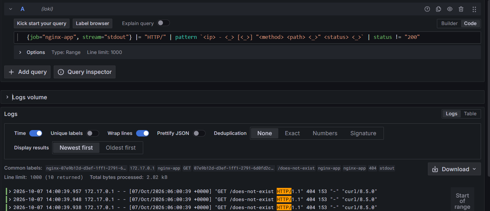

# Loki Log Aggregation Setup

Loki stores the logs, Promtail ships them, and Grafana queries them.
Promtail discovers containers through the Docker API, so it picks up the NGINX
container whether it was started by Nomad (Task 5) or by `docker run` (Task 3).

```text
nginx container stdout ──> Docker engine ──> Promtail (docker_sd) ──> Loki :3100 <── Grafana :3000
```

| File | Purpose |
|---|---|
| `docker-compose.yaml` | Starts Loki 3.0.0, Promtail 3.0.0 and Grafana 10.4.0 (pinned versions) |
| `loki-config.yaml` | Single-binary Loki, filesystem storage, TSDB schema v13, no auth |
| `promtail-config.yaml` | Docker service discovery and the relabel rules that create the labels below |

## 1. How I started the stack

```bash
cd monitoring
docker compose up -d
docker compose ps
curl -s http://localhost:3100/ready        # prints "ready" once Loki is up (about 15s)
```

```text
TODO: paste output
```

Grafana data source: open <http://localhost:3000>, go to **Connections → Data sources → Add data source → Loki**, set the URL to `http://loki:3100`, then click **Save & test**.

## 2. Label set

| Label | Where the value comes from | Example |
|---|---|---|
| `job` | Docker label `job`, set in the Nomad job's `labels` block. Containers without it get `docker` | `nginx-app` |
| `container` | Docker container name, with the leading `/` removed | `nginx-3f9c2e1a-...` |
| `nomad_alloc_id` | Docker label `com.hashicorp.nomad.alloc_id`, which Nomad's docker driver always adds | `3f9c2e1a-...` |
| `service` | Docker label `service` (Nomad job), or the compose service name for the monitoring containers | `nginx-app` |
| `stream` | `stdout` or `stderr`. NGINX writes access logs to stdout and errors to stderr | `stdout` |

Check which labels reached Loki:

```bash
curl -s http://localhost:3100/loki/api/v1/labels
curl -s http://localhost:3100/loki/api/v1/label/job/values
```

```text
TODO: paste output
```

## 3. Generating test traffic

With the Nomad allocation running (replace `<port>` with the dynamic port from `nomad alloc status`):

```bash
for i in 1 2 3 4 5; do
  curl -s -o /dev/null -w '%{http_code}\n' "http://127.0.0.1:<port>/"
  curl -s -o /dev/null -w '%{http_code}\n' "http://127.0.0.1:<port>/does-not-exist"
done
```

`/healthz` has `access_log off` in `app/nginx.conf`, so the Consul health checks every 10 s don't flood the logs.

## 4. LogQL queries

```logql
# Q1 - everything NGINX wrote to stdout (start-up messages + access log)
{job="nginx-app", stream="stdout"}

# Q2 - only non-2xx responses (line filter on the status field of the "combined" log format)
{job="nginx-app", stream="stdout"} |~ "\" [45][0-9]{2} "

# Q3 - the same, but parsing the line into fields first
{job="nginx-app", stream="stdout"}
  |= "HTTP/"
  | pattern `<ip> - <_> [<_>] "<method> <path> <_>" <status> <_>`
  | status != "200"

# Q4 - number of requests per status code over the last 10 minutes
sum by (status) (
  count_over_time({job="nginx-app", stream="stdout"} |= "HTTP/"
    | pattern `<ip> - <_> [<_>] "<method> <path> <_>" <status> <_>` [10m])
)
```

`stream="stdout"` keeps NGINX's error log (stderr) out. `|= "HTTP/"` keeps only access-log lines. The official image also prints its `/docker-entrypoint.sh: ...` start-up messages to stdout. Those lines don't match the pattern, so their `status` label comes out empty, and `status != "200"` would count them as matches.

## 5. Results

TODO: describe what each query returned with your own numbers. For example: Q1 returned 10 lines; Q2 and Q3 returned only the 5 `GET /does-not-exist ... 404` lines; Q4 showed `status="200"` → 5 and `status="404"` → 5.



## 6. Problems I hit and how I fixed them

1. **The first query matched nothing.** My original query searched for `status":4xx`, as if NGINX wrote JSON logs. NGINX's default `combined` format is plain text, like `"GET /x HTTP/1.1" 404 153`. I fixed it by matching `" 4xx "` (Q2) or parsing the line with `pattern` (Q3).
2. **The `job` label was missing.** Promtail read `job` from the Docker label `com.hashicorp.nomad.job_name`, but Nomad's docker driver only adds `com.hashicorp.nomad.alloc_id` unless the client sets `extra_labels`. I fixed it by setting `job` and `service` Docker labels in the Nomad job's `labels` block, so it works on any Nomad agent without extra client config.
3. TODO: anything else you hit while running it, for example Grafana not reaching Loki (the URL must be `http://loki:3100`, not `localhost`, because Grafana runs in its own container), or Loki answering "Ingester not ready" for the first 15 seconds.
